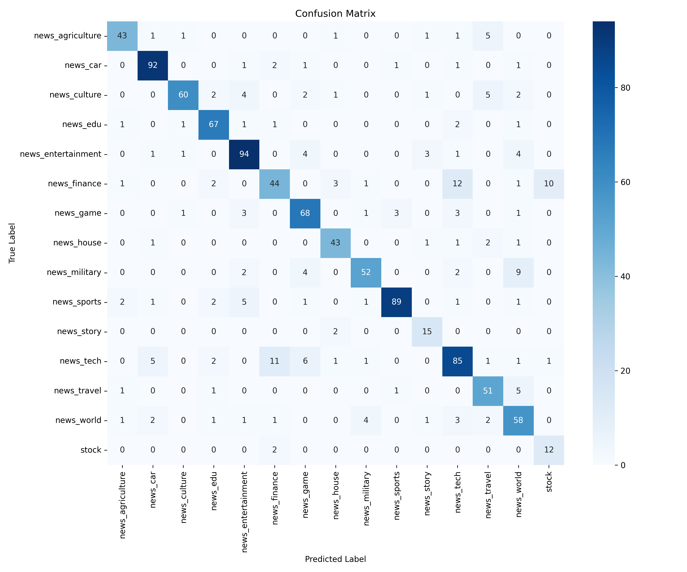
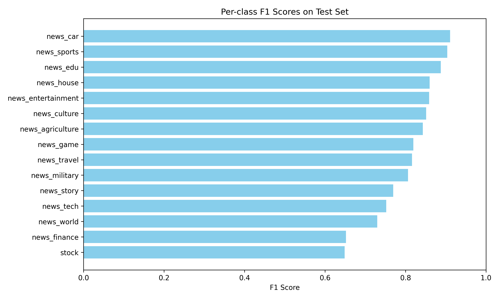

# 基于 BERT 的中文新闻标题分类

本项目基于 `bert-base-chinese` 预训练模型，使用自定义的 `BertClassifier` 模型对今日头条中文新闻标题进行多分类任务。项目完整实现了数据读取、文本预处理、模型构建、训练验证、测试评估、超参数对比以及结果可视化等流程，适合作为中文文本分类任务的入门实践项目。

## 项目简介

新闻标题分类是自然语言处理中的典型文本分类任务。相比长文本分类，新闻标题通常篇幅较短、信息密度较高，对模型的语义理解能力提出了一定要求。本项目采用 BERT 作为文本编码器，并在其基础上添加线性分类层，完成 15 类中文新闻标题分类任务。

项目主要特点如下：

- 使用 `bert-base-chinese` 作为预训练语言模型；
- 自定义 `BertClassifier` 分类模型，而非直接调用封装好的分类接口；
- 支持动态 padding，提高 batch 训练效率；
- 自动保存验证集表现最优的模型；
- 在测试集上输出 Accuracy、F1-score、分类报告等指标；
- 自动生成混淆矩阵和各类别 F1 分数柱状图；
- 设计多组超参数对比实验，分析学习率与 batch size 对模型性能的影响。

## 数据集

本项目使用今日头条新闻标题分类数据集。

- 数据来源：今日头条客户端
- 采集时间：2018 年 5 月
- 下载地址：[toutiao-text-classfication-dataset](https://github.com/aceimnorstuvwxz/toutiao-text-classfication-dataset)
- 分类数量：15 类
- 数据格式：

```text
id!_!code!_!category!_!title!_!keywords
```

本项目使用的数据划分如下：

| 数据文件 | 样本数量 | 用途 |
| ------- | -------- | ---- |
| train_3k.txt | 3000 | 训练集 |
| dev_1k.txt | 1000 | 验证集 |
| test_1k.txt | 1064 | 测试集 |

## 项目结构

```text
.
├── config.json          # 超参数配置文件
├── train.py             # 主训练脚本
├── dataset.py           # 数据集读取与处理
├── model.py             # 自定义 BertClassifier 模型
├── utils.py             # 数据加载、collate_fn、评估函数等工具函数
├── data/                # 数据集目录
├── requirements.txt     # 项目依赖
├── README.md            # 项目说明文档
└── .gitignore
```

## 环境配置

建议使用 Conda 创建独立环境：

```bash
conda create -n bert-text-cls python=3.9
conda activate bert-text-cls
```

安装依赖：

```bash
pip install -r requirements.txt -i https://pypi.tuna.tsinghua.edu.cn/simple
```

`requirements.txt` 内容如下：

```text
torch>=1.9.0
transformers>=4.20.0
scikit-learn>=1.0.0
matplotlib>=3.3.0
seaborn>=0.11.0
pandas>=1.1.0
tqdm>=4.62.0
```

## 模型结构

本项目没有直接使用 `BertForSequenceClassification`，而是基于 `BertModel` 自定义分类模型。模型结构如下：

```text
输入文本
   ↓
BERT Tokenizer
   ↓
BertModel
   ↓
[CLS] 向量表示
   ↓
Linear 分类层
   ↓
15 类新闻类别预测
```

其中，BERT 负责提取新闻标题的语义特征，线性分类层负责将文本表示映射到具体类别。

## 运行方式

在项目根目录下运行：

```bash
python train.py
```

程序会根据 `config.json` 中的参数完成模型训练、验证和测试，并在训练结束后自动加载验证集上表现最好的模型进行最终测试。

运行结束后，当前目录下会生成以下文件：

| 文件名 | 说明 |
| ------ | ---- |
| best_model.pth | 验证集最优模型权重 |
| confusion_matrix.png | 测试集混淆矩阵热力图 |
| per_class_f1.png | 各类别 F1 分数柱状图 |

## 超参数对比实验

为了分析不同超参数对模型性能的影响，本项目设计了 4 组实验。所有实验均训练 3 个 epoch，并使用标准交叉熵损失函数。

| 实验编号 | learning_rate | batch_size | 测试准确率 |
| -------- | ------------- | ---------- | ---------- |
| 1 | 2e-5 | 32 | 81.95% |
| 2 | 1e-5 | 32 | 80.17% |
| 3 | 3e-5 | 32 | 83.46% |
| 4 | 3e-5 | 16 | 83.46% |

从实验结果可以看出：

- 当 batch size 固定为 32 时，学习率 `3e-5` 的效果优于 `2e-5` 和 `1e-5`；
- 在学习率为 `3e-5` 时，batch size 为 16 和 32 的测试准确率相同；
- 考虑到训练效率，最终选择 `learning_rate=3e-5`、`batch_size=32` 作为最优配置。

因此，本项目最终采用的超参数配置为：

```text
learning_rate = 3e-5
batch_size = 32
epoch = 3
```

## 最优模型实验结果

最优模型对应实验三，即：

```text
learning_rate = 3e-5
batch_size = 32
```

整体测试结果如下：

| 指标 | 数值 |
| ---- | ---- |
| 测试准确率 | 83.46% |
| 测试 F1 分数 | 0.8346 |
| 最佳验证准确率 | 83.20% |

## 各类别分类结果

| 类别 | Precision | Recall | F1-score | Support |
| ---- | --------- | ------ | -------- | ------- |
| news_agriculture | 0.84 | 0.79 | 0.82 | 53 |
| news_car | 0.91 | 0.94 | 0.93 | 99 |
| news_culture | 0.94 | 0.83 | 0.88 | 77 |
| news_edu | 0.86 | 0.92 | 0.89 | 74 |
| news_entertainment | 0.85 | 0.88 | 0.86 | 108 |
| news_finance | 0.72 | 0.77 | 0.75 | 74 |
| news_game | 0.76 | 0.85 | 0.80 | 80 |
| news_house | 0.85 | 0.80 | 0.82 | 49 |
| news_military | 0.83 | 0.72 | 0.78 | 69 |
| news_sports | 0.97 | 0.84 | 0.90 | 103 |
| news_story | 0.82 | 0.82 | 0.82 | 17 |
| news_tech | 0.75 | 0.82 | 0.78 | 114 |
| news_travel | 0.85 | 0.86 | 0.86 | 59 |
| news_world | 0.75 | 0.82 | 0.79 | 74 |
| stock | 0.86 | 0.43 | 0.57 | 14 |

从分类结果可以看出，模型在 `news_car`、`news_culture`、`news_edu`、`news_sports` 等类别上取得了较好的效果。其中，`stock` 类别由于测试样本数量较少，仅有 14 条，因此 F1-score 相对较低，属于数据不平衡情况下较为常见的现象。

## 可视化结果

### 混淆矩阵

训练结束后，程序会自动生成测试集混淆矩阵，用于观察不同类别之间的误分类情况。



### 各类别 F1 分数

程序还会生成各类别 F1 分数柱状图，便于直观比较模型在不同类别上的分类效果。



## 核心功能

本项目主要实现了以下功能：

1. 数据读取与预处理  
   从原始数据文件中读取新闻标题和类别标签，并完成标签映射与文本编码。

2. 自定义 BERT 分类模型  
   使用 `BertModel + Linear` 的方式构建文本分类器，便于理解 BERT 文本分类的基本流程。

3. 动态 padding  
   通过自定义 `collate_fn` 实现 batch 内动态填充，减少不必要的 padding 长度，提高训练效率。

4. 模型训练与验证  
   在训练过程中记录验证集准确率，并自动保存验证集表现最优的模型参数。

5. 测试集评估  
   加载最优模型，在测试集上计算 Accuracy、F1-score，并输出完整分类报告。

6. 实验结果可视化  
   自动生成混淆矩阵热力图和各类别 F1 分数柱状图，便于分析模型表现。

## 实验结论

本项目基于 `bert-base-chinese` 实现了一个中文新闻标题分类模型，并在今日头条新闻标题数据集上完成了 15 分类实验。实验结果表明，BERT 能够较好地捕捉新闻标题中的语义信息，在小规模训练集上也能取得较稳定的分类效果。

在超参数对比实验中，`learning_rate=3e-5`、`batch_size=32` 的组合取得了最优结果，测试准确率达到 83.46%，测试 F1 分数达到 0.8346。整体来看，该项目验证了 BERT 在中文短文本分类任务中的有效性，也为后续进一步改进模型结构、扩充数据规模和处理类别不平衡问题提供了基础。

## 后续改进方向

后续可以从以下几个方面继续优化：

- 增加训练数据规模，缓解部分类别样本数量不足的问题；
- 使用类别权重或重采样方法改善类别不平衡问题；
- 尝试更长训练轮数，并结合早停机制提升模型稳定性；
- 对比 `BertForSequenceClassification`、RoBERTa、MacBERT 等模型效果；
- 引入学习率调度器，进一步提升训练收敛效果；
- 增加命令行参数配置，使训练过程更加灵活。

## License

本项目仅用于学习与实验研究。
